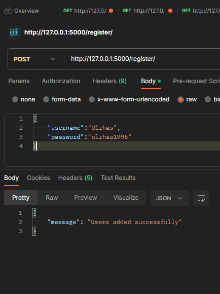
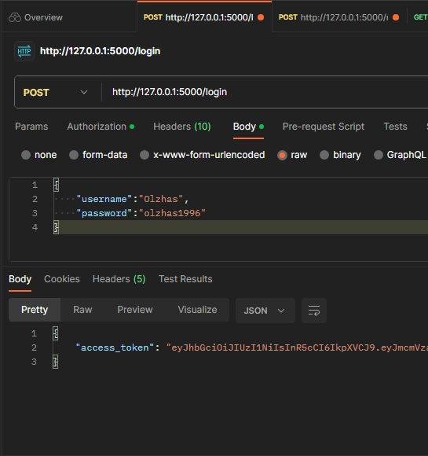
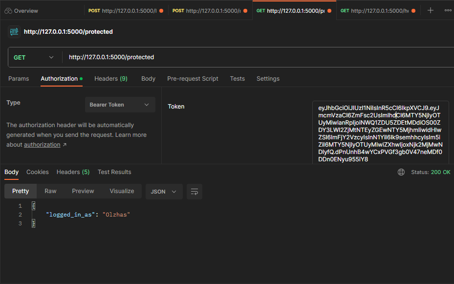
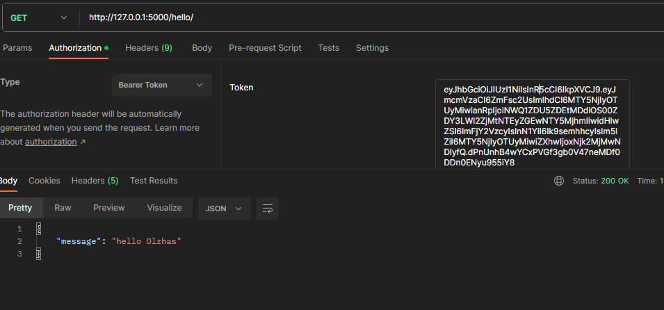

# JWT_flask

1. Клонирование репозитория git clone https://github.com/OlzhasKALIEV/JWT_flask.git
2. Создание виртуального окружения python -m venv venv
3. Запуск виртуального окружения .\venv\Scripts\activate

Регистрация пользователей: POST запрос на пути "/register/". Перед добавлением нового пользователя в базу данных, его данные проверяются с помощью схемы "schema_register". Если пользователь уже существует, возвращается сообщение "Пользователь уже существует". Если регистрация прошла успешно, возвращается сообщение "Пользователь успешно добавлен".

Регистрация

POST: http://127.0.0.1:5000/register/

формат отправки: 
JSON = {
    "username":"Olzhas",
    "password":"olzhas1996"
}

Аутентификация для генерации токена

POST: http://127.0.0.1:5000/login

формат отправки для проверки: 

JSON = {
    "username":"Olzhas",
    "password":"olzhas1996"
}

Проверка логина 

GET: http://127.0.0.1:5000/protected

